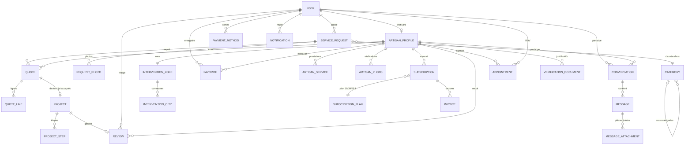

# TrouveMoi — Schéma des entités Doctrine

> 24 entités · 11 enums · 22 repositories — PHP 8.3, attributs Doctrine, `strict_types`,
> `DateTimeImmutable` + `PreUpdate`, conventions calquées sur les entités Users existantes.
> **Aucune de tes 5 entités existantes n'est modifiée** : toutes les relations vers
> `User` / `ArtisanProfile` sont **unidirectionnelles** (owning side chez moi).

## Arborescence

```
src/Entity/
├── Users/            (existant — intouché) User, UserProfile, ArtisanProfile,
│                     CommercialPartnerProfile, ResetPasswordRequest
├── Enum/             RequestStatus, QuoteStatus, ProjectStatus, AppointmentType,
│                     AppointmentStatus, SubscriptionPlanCode, SubscriptionStatus,
│                     InvoiceStatus, VerificationDocumentType, NotificationType, PriceUnit
├── Catalog/          Category (arbre parent/enfants), ArtisanService, ArtisanPhoto (Vich)
├── Requests/         ServiceRequest, RequestPhoto (Vich)
├── Quotes/           Quote, QuoteLine
├── Projects/         Project, ProjectStep
├── Messaging/        Conversation, Message, MessageAttachment (Vich)
├── Reviews/          Review
├── Favorites/        Favorite
├── Billing/          SubscriptionPlan, Subscription, Invoice, PaymentMethod
├── Scheduling/       Appointment
├── Geo/              InterventionZone, InterventionCity
├── Verification/     VerificationDocument (Vich)
└── Notifications/    Notification
```

## Le flux métier central

```
ServiceRequest (client) ──1:N──▶ Quote (artisan) ──accept()──▶ Project ──▶ Review
        │                          │  └─1:N QuoteLine (totaux bcmath)      (1 avis / chantier)
        └─1:N RequestPhoto         └─ reference unique DEV-XXXX
```

## Diagramme entités-relations (Mermaid)



## Décisions notables

| Sujet | Choix | Pourquoi |
|---|---|---|
| Argent | `DECIMAL(10,2)` en `string` PHP + **bcmath** (`Quote::recalculateTotals`) | jamais de float sur les montants ; même style que `commissionRate` |
| Statuts | enums string adossés avec `label()` français | affichage Twig direct : `{{ quote.status.label }}` |
| Adresse d'une demande | `addressLine1` privé, `postalCode/city/district` publics + `getPublicLocation()` | règle produit : l'adresse exacte n'est transmise qu'après acceptation |
| Uploads | 4 entités Vich (`artisan_photos`, `request_photos`, `message_attachments`, `verification_documents`) avec `Name/Size/MimeType` | mappings à déclarer dans `vich_uploader.yaml` |
| Unicité | contraintes SQL : 1 favori/couple, 1 zone/artisan, 1 avis/chantier, 1 conversation/(client, artisan, demande), références devis/projet/facture | intégrité garantie en base, pas seulement en appli |
| Cycle de vie | méthodes métier : `publish()`, `markAsSent()`, `accept()`, `refuse()`, `complete()`, `respond()`, `submit()/approve()/reject()`, `markPaid()`, `cancel()` | les transitions d'état vivent dans l'entité |
| Suppressions | `onDelete: CASCADE` sur les enfants, `SET NULL` sur les liens optionnels, `RESTRICT` sur Category/Plan | pas d'orphelins, pas de suppression de référentiel utilisé |

## Inverses optionnels (si besoin plus tard)

Pour naviguer `$artisanProfile->getServices()` etc., il suffira d'ajouter côté `ArtisanProfile`
des `OneToMany(mappedBy: 'artisanProfile')` — les owning sides sont déjà prêts.

## Mise en route

```bash
php bin/console doctrine:migrations:diff
php bin/console doctrine:migrations:migrate
```

## Ajouts de l'audit SaaS (v2)

64 champs optionnels ajoutés, tous marqués `// ── Champ optionnel ajouté lors de l'audit SaaS ──`
dans le code. Les plus structurants pour le modèle économique :

- **SubscriptionPlan.maxQuotesPerMonth** (`null` = illimité) + **Subscription.quotesUsedInPeriod**
  et les méthodes `canSendQuote()` / `incrementQuotesUsed()` / `resetPeriodUsage()` — c'est le
  mécanisme du forfait : l'artisan ne peut répondre que si son abonnement est actif et son quota
  non épuisé.
- **ServiceRequest.maxQuotes / quotesCount / awardedQuote** + `canReceiveMoreQuotes()` / `award()` —
  plafond de devis par demande et traçage du devis retenu.
- **Quote.viewedByClientAt / remindedAt / signedAt / signatureIp / depositPercent / discountHt** —
  cycle de vie commercial complet (vu, relancé, signé en ligne, acompte, remise).
- **Invoice.billingName / billingAddress / periodStartsAt / periodEndsAt** — snapshots légaux.
- **VerificationDocument.expiresAt** + `isExpired()` et **reviewedBy** — renouvellement annuel
  des assurances et traçabilité de l'admin validateur.
- **Project.amountTtc / addressLine1 / postalCode / city** — snapshot du chantier, insensible aux
  modifications ultérieures du devis ou du profil.
- Modération (`moderatedAt`), annulations tracées (`cancelledAt` + `cancellationReason`),
  notifications multi-canal (`emailSentAt` / `pushSentAt`), sous-notes d'avis
  (qualité / ponctualité / propreté, `wouldRecommend`), SEO catégories (`metaTitle` /
  `metaDescription`), analytics (`ServiceRequest.source`).

### Suggestions pour tes entités existantes (non modifiées)

- **ArtisanProfile** : compteurs dénormalisés `averageRating`, `reviewsCount`,
  `responseRatePercent`, `avgResponseTimeMinutes`, `projectsCount` (nécessaires pour afficher
  « 4,8 · 256 avis · répond en ~1 h · 98 % » sans jointures), plus `websiteUrl`, `foundedYear`,
  `employeesCount`.
- **User** : `lastLoginAt`, `deletedAt` (soft delete RGPD), `timezone`, `locale`.
